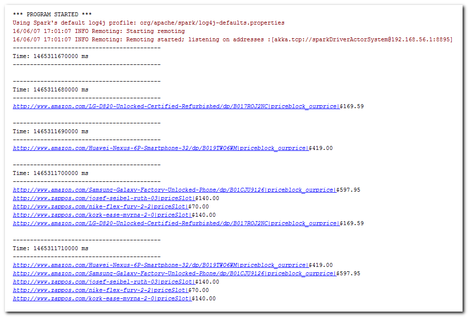

# Spark Streaming Html Parser
Using Spark Streaming, visit multiple websites; for each site, extract text within one HTML tag based on ID.

For example, visit "http://www.amazon.com/LG-D820-Unlocked-Certified-Refurbished/dp/B017ROJ2NC", locate one HTML tag satisfying id equaling "priceblock_ourprice", then simply extract its text. Similarly, another link "http://www.zappos.com/josef-seibel-ruth-03", then id "priceSlot", get the text within.

The main idea here is to write a Customized Receiver for Spark Streaming.

## Software Environment:

* Apache Spark v1.6.1

* IntelliJ IDEA Community Edition 2016.1.2 (with Scala plugin)

* Scala v2.10.5

* Java SDK v1.8.0_92 64-bit

* htmlcleaner-2.16

## References:

1. [Spark Streaming Custom Receivers](http://spark.apache.org/docs/latest/streaming-custom-receivers.html)

2. [Spark Streaming Programming Guide](http://spark.apache.org/docs/latest/streaming-programming-guide.html)

3. [Html Cleaner](http://htmlcleaner.sourceforge.net)
